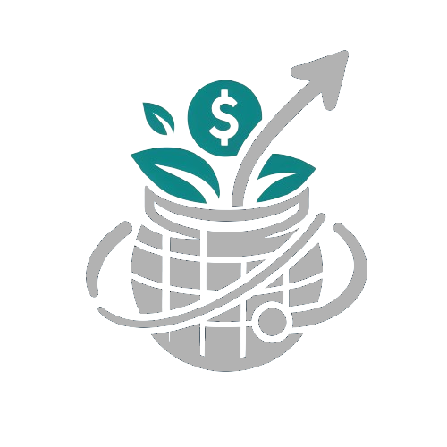
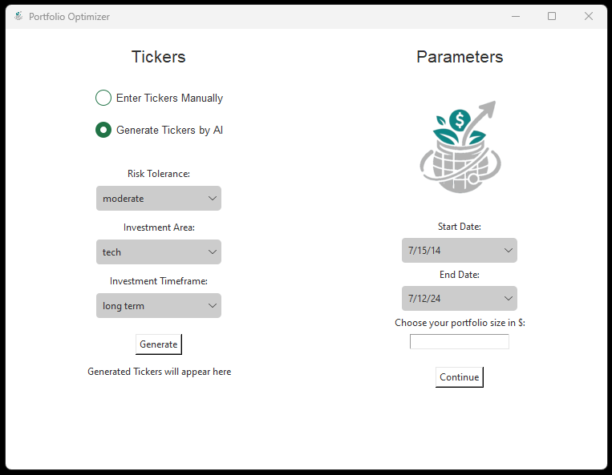
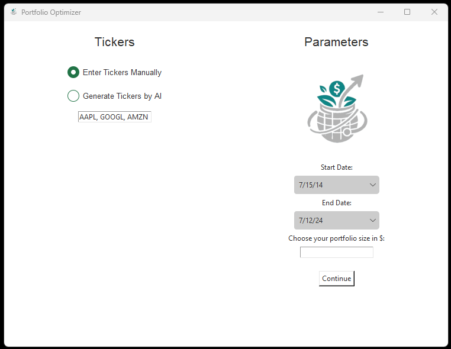
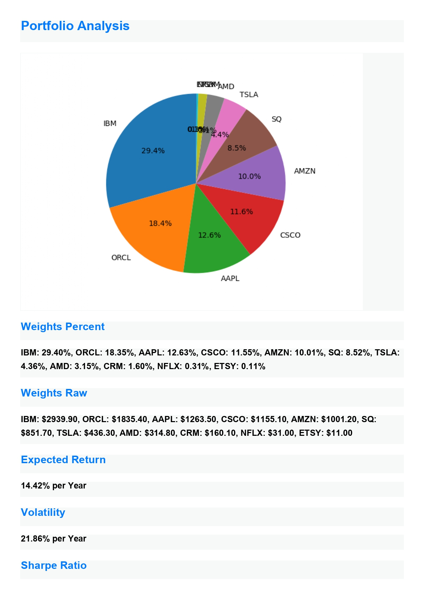
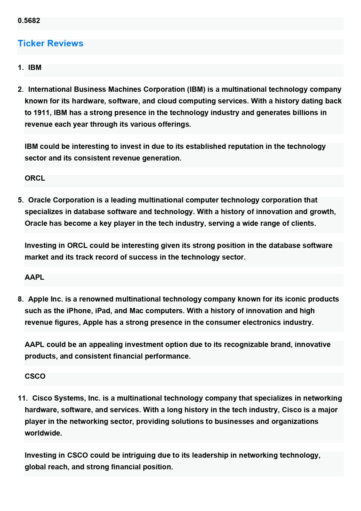

<!-- Improved compatibility of back to top link: See: https://github.com/othneildrew/Best-README-Template/pull/73 -->
<a name="readme-top"></a>
<!--
*** Thanks for checking out the Best-README-Template. If you have a suggestion
*** that would make this better, please fork the repo and create a pull request
*** or simply open an issue with the tag "enhancement".
*** Don't forget to give the project a star!
*** Thanks again! Now go create something AMAZING! :D
-->


<!-- PROJECT SHIELDS -->
<!--
*** I'm using markdown "reference style" links for readability.
*** Reference links are enclosed in brackets [ ] instead of parentheses ( ).
*** See the bottom of this document for the declaration of the reference variables
*** for contributors-url, forks-url, etc. This is an optional, concise syntax you may use.
*** https://www.markdownguide.org/basic-syntax/#reference-style-links
-->


<!-- PROJECT LOGO -->
<h1 align="center">
  <br>
  <a href="http://www.amitmerchant.com/electron-markdownify"></a>
  <br>
  AI Portfolio Optimizer
  <br>
</h1>

<h4 align="center">A financial portfolio optimization tool enhanced with AI integration for simplified utilization</h4>
<br>


<!-- TABLE OF CONTENTS -->

<h3>Table of Contents</h3>
  <ol>
    <li>
      <a href="#features">Features</a>
    </li>
    <li>
      <a href="#about-the-portfolio-optimization-logic">About the Portfolio Optimization Logic</a>
    </li>
<li><a href="#built-with">Built With</a></li>
    <li>
      <a href="#getting-started">Getting Started</a>
      <ul>
        <li><a href="#prerequisites">Prerequisites</a></li>
        <li><a href="#installation">Installation</a></li>
      </ul>
    </li>
    <li><a href="#license">License</a></li>
    <li><a href="#contact">Contact</a></li>
    <li><a href="#acknowledgments">Acknowledgments</a></li>
  </ol>


<!-- ABOUT THE PROJECT -->

## About AI Portfolio Optimizer

This tool enables you to create diversified asset portfolios while maximizing expected returns with an easy-to-use and beginner-friendly desktop app.

## Features

There are two ways to use the app: you can **manually enter the tickers**, or you can **generate them using AI**. The
generation
is done using a GPT prompt containing variables such as **risk tolerance**, **investment area**, and **investment
timeframe**. It
should be noted that the accuracy of the generated tickers and adherence to the chosen variables cannot be guaranteed,
and the generated tickers are likely to change even with the exact same parameters. However, it can be a useful solution
for simulating portfolios in investment areas where you are not familiar with many tickers.




You must also enter parameters before starting the simulation. 
The **start date** and **end date** will serve as the **time frame**
for the analysis. You will also need to enter a portfolio size in dollars to proceed with the simulation. This variable is purely
anecdotal and will strictly serve to indicate how much money you should invest in each asset if you strictly adhere to
the results of the portfolio optimization.

Then, you can click on "Continue," and after about one minute, an analysis of the portfolio will be saved as a PDF in
the **created_portfolios** folder, and the PDF will open in a browser page.

**The analysis will contain:**

- The weights in % and $ per asset displayed in a pie chart and in text
- The expected volatility (per year)
- The expected return (per year)
- The Sharpe ratio

**Finally, a review of each ticker (where the weight is > 0) will include:**

- The company name
- The history of the company
- A reason to invest in this asset

The ticker reviews are generated using a GPT prompt, so the accuracy of the information cannot be 100% guaranteed, even
though I specified in the prompt that, in case of a lack of information, it should not hallucinate and should inform in
the review that there is a lack of sources for this ticker.




## About the Portfolio Optimization Logic

The app's logic is grounded in several famous and internationally recognized financial and mathematical theories. The
most notable is
the [Modern Portfolio Theory](https://www.investopedia.com/terms/m/modernportfoliotheory.asp#:~:text=The%20modern%20portfolio%20theory%20(MPT)%20was%20a%20breakthrough%20in%20personal,entirely%20with%20low-risk%20choices.) (
MPT), developed in 1952 by Nobel Prize-winning financial expert Harry Markowitz. MPT is an investment theory that
enables investors to construct an asset portfolio that maximizes expected return for a given level of risk.

The app also uses the [Capital Asset Pricing Model (CAPM)](https://www.investopedia.com/terms/c/capm.asp). CAPM is a
model that describes the relationship between systematic risk and expected return for assets, particularly stocks. It is
used to price risky securities and generate expected returns for## Usage

### Using Docker (Recommended)

1.  **Start the App:**
    ```bash
    docker compose up -d
    ```

2.  **Open the App:**
    Navigate to `http://localhost:8000`.

3.  **Stop the App:**
    ```bash
    docker compose down
    ```

### Local Development

1.  **Start the Web Server:**
    ```bash
    uvicorn main:app --reload
    ```

2.  **Open the App:**
    Open your browser and navigate to `http://localhost:8000`.

3.  **Optimize:**
    - Enter tickers manually or use the **AI Suggest** feature.
    - Set your parameters (dates, investment amount).
    - Click **Analyze Portfolio** to see the optimal allocation and performance metrics.
For most of the financial calculations I utilized the package [PyPortfolioOpt](https://github.com/robertmartin8/PyPortfolioOpt).

## Built With

* 
* 
* 

<!-- GETTING STARTED -->

## Getting Started

### Prerequisites

* Python 3.12

### Installation

1. Clone the repo :
   ```sh
   git clone https://github.com/Juicyyyyyyy/portfolio_optimizer
   ```
2. Install requirements : <br>
   ```sh 
   pip install .
   ```
   or
   ```sh
   pip install -r requirements. txt
   ```
3. If you wish to use the AI feature, get your Open AI API Key
   at [https://platform.openai.com/docs/overview](https://platform.openai.com/docs/overview)
   then create a **.env** file in the root folder and enter your API key :
   ```dotenv
   OPENAI_API_KEY=ENTER_YOUR_API_KEY
   ```
4. Launch the app :
   ```sh
   python app.py
   ```

<!-- LICENSE -->

## License

Distributed under the MIT License. </br>


<!-- CONTACT -->

## Contact

[](https://www.linkedin.com/in/corentin-dupaigne-b449a1242/)

Mail: corentin.dupaigne@gmail.com
</br>
Portfolio: https://corentindupaigne.herokuapp.com


<!-- ACKNOWLEDGMENTS -->

## Acknowledgments

Some of the resources that helped me into creating this project

* [Yahoo Finance API](https://developer.yahoo.com/api/)
* [PyPortfolioOpt](https://github.com/robertmartin8/PyPortfolioOpt)
* [Tkinter](https://github.com/topics/tkinter-python)
* [Quantinsti](https://blog.quantinsti.com/calculating-covariance-matrix-portfolio-variance/)
* [Quantgestion](https://quantgestion.fr/le-modele-de-fisher-black-et-robert-litterman/)
* [Best-README-Template](https://github.com/othneildrew/Best-README-Template)

<!-- MARKDOWN LINKS & IMAGES -->
<!-- https://www.markdownguide.org/basic-syntax/#reference-style-links -->

[contributors-shield]: https://img.shields.io/github/contributors/othneildrew/Best-README-Template.svg?style=for-the-badge

[contributors-url]: https://github.com/othneildrew/Best-README-Template/graphs/contributors

[forks-shield]: https://img.shields.io/github/forks/othneildrew/Best-README-Template.svg?style=for-the-badge

[forks-url]: https://github.com/othneildrew/Best-README-Template/network/members

[stars-shield]: https://img.shields.io/github/stars/othneildrew/Best-README-Template.svg?style=for-the-badge

[stars-url]: https://github.com/othneildrew/Best-README-Template/stargazers

[issues-shield]: https://img.shields.io/github/issues/othneildrew/Best-README-Template.svg?style=for-the-badge

[issues-url]: https://github.com/othneildrew/Best-README-Template/issues

[license-shield]: https://img.shields.io/github/license/othneildrew/Best-README-Template.svg?style=for-the-badge

[license-url]: https://github.com/othneildrew/Best-README-Template/blob/master/LICENSE.txt

[linkedin-shield]: https://img.shields.io/badge/-LinkedIn-black.svg?style=for-the-badge&logo=linkedin&colorB=555

[linkedin-url]: https://www.linkedin.com/in/corentin-dupaigne-b449a1242

[product-screenshot]: images/main_app.png

[Next.js]: https://img.shields.io/badge/next.js-000000?style=for-the-badge&logo=nextdotjs&logoColor=white

[Next-url]: https://nextjs.org/

[React.js]: https://img.shields.io/badge/React-20232A?style=for-the-badge&logo=react&logoColor=61DAFB

[React-url]: https://reactjs.org/

[Vue.js]: https://img.shields.io/badge/Vue.js-35495E?style=for-the-badge&logo=vuedotjs&logoColor=4FC08D

[Vue-url]: https://vuejs.org/

[Angular.io]: https://img.shields.io/badge/Angular-DD0031?style=for-the-badge&logo=angular&logoColor=white

[Angular-url]: https://angular.io/

[Svelte.dev]: https://img.shields.io/badge/Svelte-4A4A55?style=for-the-badge&logo=svelte&logoColor=FF3E00

[Svelte-url]: https://svelte.dev/

[Laravel.com]: https://img.shields.io/badge/Laravel-FF2D20?style=for-the-badge&logo=laravel&logoColor=white

[Laravel-url]: https://laravel.com

[Bootstrap.com]: https://img.shields.io/badge/Bootstrap-563D7C?style=for-the-badge&logo=bootstrap&logoColor=white

[Bootstrap-url]: https://getbootstrap.com

[JQuery.com]: https://img.shields.io/badge/jQuery-0769AD?style=for-the-badge&logo=jquery&logoColor=white

[JQuery-url]: https://jquery.com 
